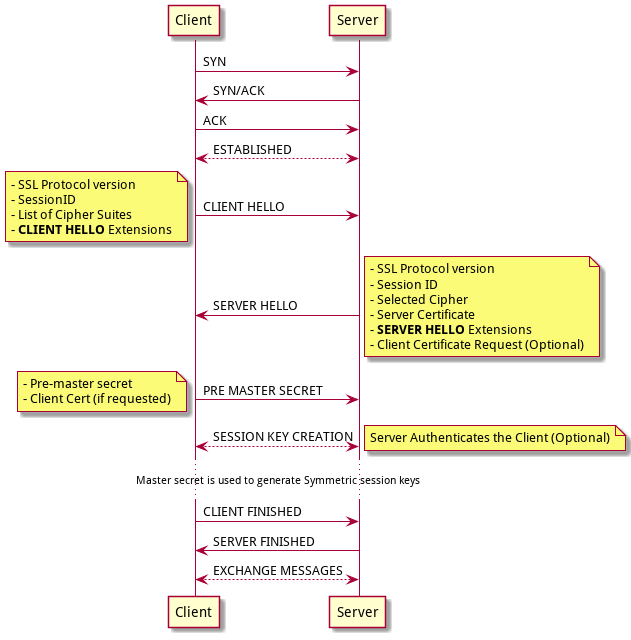

# TLS Handshake

## What do TLS use to ?

TLS provide a secure way to communicate between two peers.

- It guarantees **privacy**, only the recipient can read the sent messages.

- Each peer is **authenticated** and nobody can steal their identities.

- Once the message is sent, it's impossible to alter the message without break the **data integrity**.

