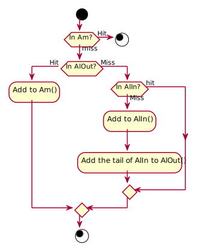

# 2Q algorithm

2Q algorithm consideres both recently use and frequently used pages.

- $AlIn$ is a [[[c402598f]]] buffer that retain newly referenced pages.
- $AlOut$  is a [[[c402598f]]] buffer that is used to detect pages that have high long-term access rates.
- $Am$  is the main [[[c402598f]]] buffer that store long-term pages.

[2Q: A Low Overhead High Performance Buffer Management Replacement Algorithm](http://www.vldb.org/conf/1994/P439.PDF)